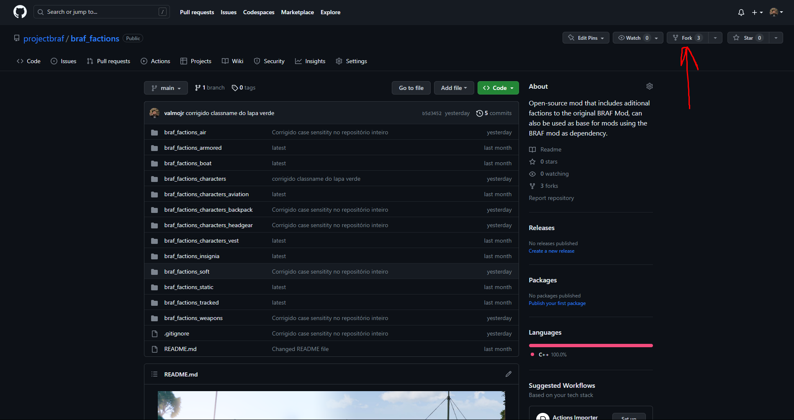
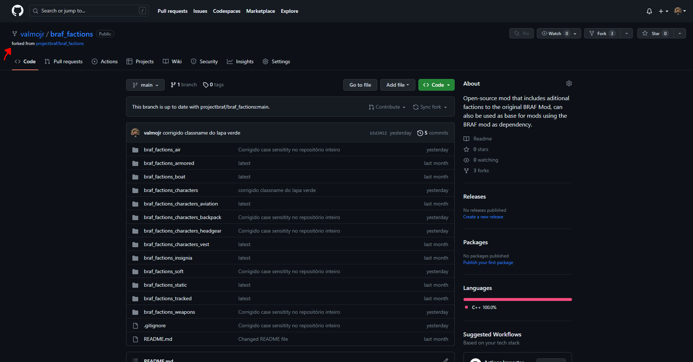
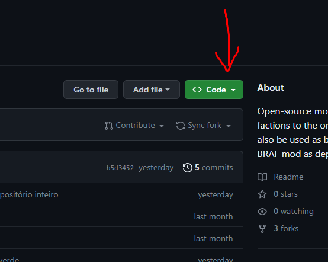
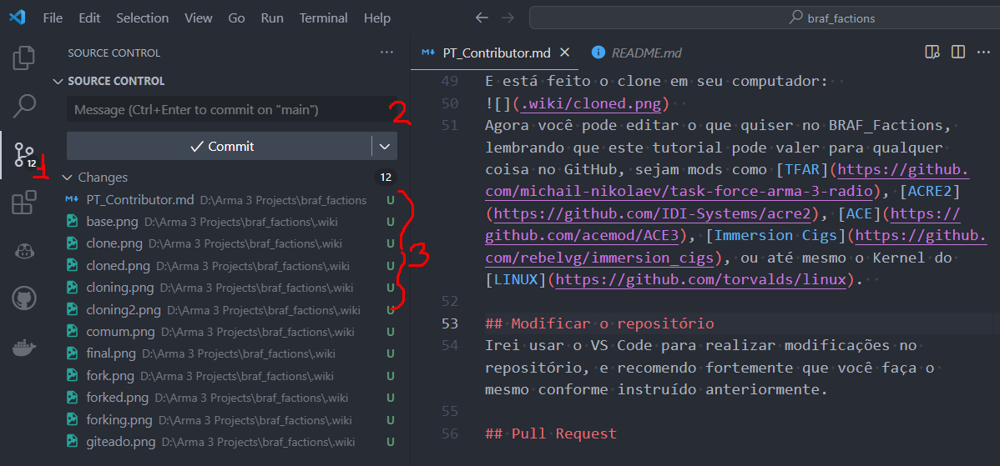
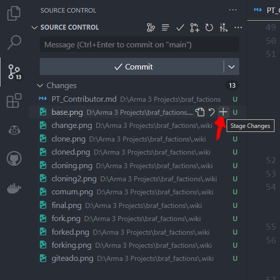
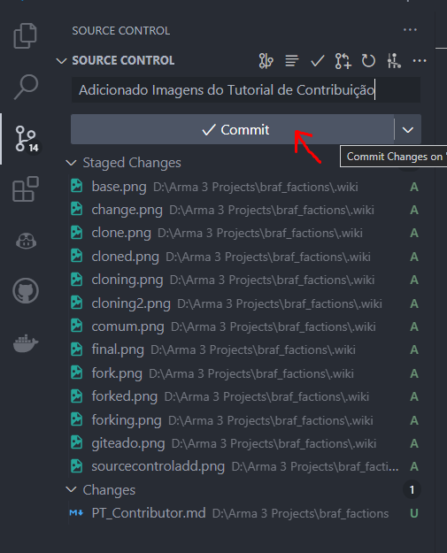
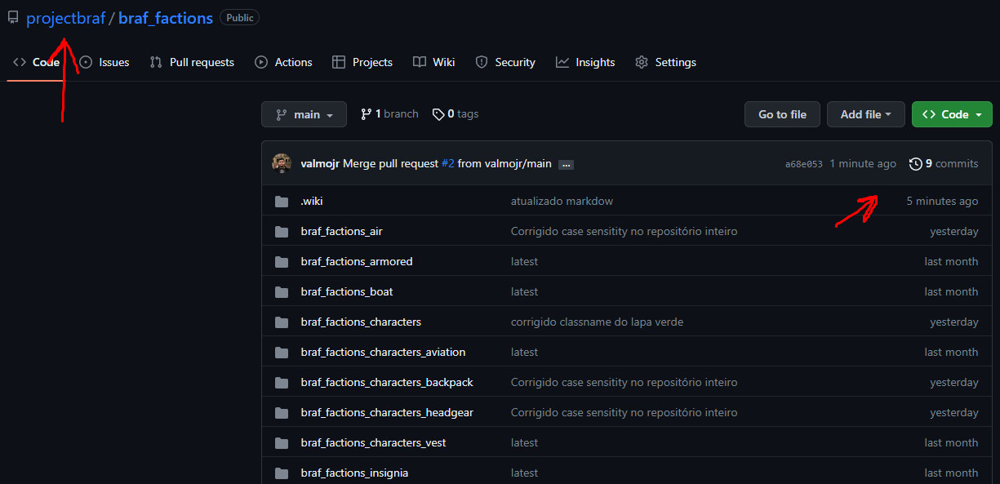

# Como contribuir para o BRAF Factions
O BRAF Factions é uma porção do BRAF destinado a servir de template para mods que usem o BRAF como dependência e é desenvolvido em código aberto, ou seja, qualquer um pode contribuir com o seu desenvolvimento. O versionamento é feito pelo GitHub, este site em que você se encontra.

Para começar, é preciso que você:
- Tenha uma conta cadastrada no GitHub, caso não tenha, [clique aqui](https://github.com/signup?ref_cta=Sign+up&ref_loc=header+logged+out&ref_page=%2F&source=header-home).
- Tenha o Git instalado no seu PC, [download aqui](https://git-scm.com/downloads), recomendo selecionar as opções de permitir adicionar as ações de Git Bash e Git GUI quando solicitado no instalador.

## O que é versionamento
Ok, instalei tudo o que eu acho que preciso, mas o que exatamente é Git? bem, para começar, imagine que você está de volta ao seu ensino fundamental, e a professora tetéia passou uma tarefa que deve ser entregue em uma pasta contendo vários arquivos interdependentes a ser resolvida por você, seu amigo 1 e seu outro amigo 2. Antes de começarem, vocês estarão longe da conclusão da tarefa, que assim ilustraremos:

Bem, o mais comum é que o grupo se divida e atribua uma parte para cada integrante, juntando o cada parte para formar trabalho após concluído cada pedaço, não é mesmo?

Ok, mas e quando precisamos fazer correções, ou pequenos ajustes? ou simplesmente a tarefa é contínua e a estrela da conclusão é divida em várias partes, como organizamos as versões do projeto?  
  
Complicado de entender né? É para isso que serve o Git, para organizar o seu projeto e administrar cada atualização feita por cada contribuinte
  
Na primeira versão, todos juntaram suas partes ao projeto, na segunda houve uma adição do amigo 1 e de você, na terceira houve uma contribuição do amigo 1 e amigo 2, e assim por diante. o Git auxilia a organização destas alterações, podendo permitir que o amigo 2 trabalhe em uma parte mais delicada desde a versão 1 enquanto você e o amigo 1 gerem outras 4 versões do projeto e o amigo 2 só adicione seu progresso ao projeto após várias versões, permitindo desenvolver o projeto de maneira assíncrona.  
O GitHub é somente uma plataforma que irá hospedar gratuitamente (porém não muito, existem várias limitações) os projetos que você queira, podemos fazer uma analogia com pornografia e o PornHub. Eis um vídeo explicando o que é o GitHub:  
  
Como dito anteriormente, este é um repositório hospedado no GitHub e tudo o que está dentro dele é passível de melhorias, inclusive o próprio texto que você está lendo.

## Fork
Sabendo o que é versionamento, devidamente cadastrado no GitHub e com o Git instalado em sua máquina, podemos baixar e modificar o BRAF Factions, seja para interesses próprios, um mod que use o BRAF como dependência, aprender a desenvolver addons para o Arma 3, ou seja para contribuir com algo aqui. Para isso, é preciso que criemos um Fork no perfil pessoal.  
Clique no Botão "Fork" no canto superior direito  

Crie o Fork no seu perfil do GitHub  clicando em "Create Fork"

Feito, agora tenho uma bifurcação do projeto que posso utilizar para os meus interesses
  
Mas feito isso, como que de fato eu tenho estes arquivos para trabalhar no meu computador? a resposta é clonar o repositório.

## Clone
  
Para clonar o repositório é preciso pegar o URL do repositório git:
  
Temos como URL do repositório
> https://github.com/seu_usuario_do_github_aqui/braf_factions.git  

e com este endereço em mãos, é hora de clonar na nossa máquina.
Pessoalmente, eu recomendo que o clone seja feito direto na pasta raíz do P Drive, caso você não tenha, ou não saiba configurar o P Drive para desenvolver mods para Arma 3, [clique aqui](). Irei usar a linha de comando do git para explicar o que irei fazer para que fique mais fácil de entender o passo-a-passo, mas tudo também poderá ser feito através do Git GUI (versão gráfica do git). Para isso irei abrir o powershell do windows e digitar os seguintes comandos:
> cd P:/  

Direcionei o terminal para o P Drive

> git clone https://github.com/seu_usuario_do_github_aqui/braf_factions.git

Clonei o repositório no endereço em que o terminal está, o nome da pasta irá copiar o nome do repositório, que no caso será "braf_factions", nesta hora o git irá pedir suas credenciais do github caso não estejam configuradas. O repositório, que pesa aproxidamente 2 GB irá ser baixado.  
  
E está feito o clone em seu computador:  
  
Agora você pode editar o que quiser no BRAF_Factions, lembrando que este tutorial pode valer para qualquer coisa no GitHub, sejam mods como [TFAR](https://github.com/michail-nikolaev/task-force-arma-3-radio), [ACRE2](https://github.com/IDI-Systems/acre2), [ACE](https://github.com/acemod/ACE3), [Immersion Cigs](https://github.com/rebelvg/immersion_cigs), ou até mesmo o Kernel do [LINUX](https://github.com/torvalds/linux).  

## Modificar o repositório
As modificações que serão realizadas são adição desta página dessas instruções para contribuições e as imagens mostradas, irei usar o VS Code para realizar modificações no repositório, e recomendo fortemente que você faça o mesmo conforme instruído anteriormente.  

1. O ícone no VSCode da aba de Source Control (versionamento) que é nativa do VSCode para lidar com Git.
2. A Caixa de seleção para adicionar a mensagem do commit(já irei explicar).
3. Os arquivos que foram modificados no repositório
O Git organiza o versionamento através de Commits, que são pontos aos quais você define quais arquivos foram modificados e opcionalmente adiciona uma mensagem explicando o que foi feito. Para isso irei selecionar os arquivos que quero fazer o commit e adicionar ao staging area (área dos arquivos que vão para o commit)
  
Podemos usar o comando "git add nome_do_arquivo" para fazer a mesma coisa com arquivos ou pastas através de linha de comando.  
  
Note que adicionei todos as imagens mas mantive o arquivo PT_Contributor.md fora da área que irá para o commit, adicionei a mensagem "Adicionado Imagens do tutorial de contribuição", o comando "git commit" produz o commit na linha de comando. então com a mensagem de commit o comando será:
> git commit -m "Adicionado imagens do tutorial de contribuição"  

Note que estamos trabalhando na branch "main", que é a padrão de repositórios originados no GitHub, o que não nos impede de criar quantas branches quisermos para qualquer finalidade que gostariamos, as branches nada mais são do que formas de "isolar" versões desejadas do repositório, como quando você está trabalhando em uma funcionalidade específica do projeto e não quer correr o risco de comprometer o projeto inteiro com ela.
Já que temos o nosso primeiro commit adicionado ao nosso repositório local, caso queiramos transferir essas modificações para o nosso fork feito no github (ou seja, passar o nosso commit para o github), podemos também utilizar o VS Code ou linha de comando para realizar um push, por padrão o repositório ao qual o clone é feito é denominado origin, no VS Code é possível fazer isso no canto inferior esquerdo da tela:  
  
note que o VSCode aponta qual a branch que estamos trabalhando, que no caso é a main e coloca um asterisco nela, indicando que há arquivos que foram alterados que não foram commitados, o VSCode também aponta que o repositório local está 1 commit além do repositório origem, e ao clicar na indicação ele irá automaticamente realizar o push do commit, atualizando em nosso repositório no github as mudificações recém feitas, o comando para fazer a mesma ação é:
> git push origin main  
Sendo origin o repositório origem que foi clonado e main a branch dele.
  
Caso você queira adicionar sua contribuição ao repositório original do BRAF Factions, é hora de abrir um Pull Request, para isso irei criar um novo commit e preparar para adicioná-lo ao repositório original.

## Pull Request

Note que o GitHub já detectou que o repositório pessoal está um commit acima do repositório do projectbraf, o que adiciona a opção contribute que iremos usar para criar o Pull Request.
  
Agora temos a tela de Pull Request, onde opcionalmente podemos adicionar mais informações a respeito do que gostariamos de adicionar, para facilitar o trabalho de quem for verificar o Pull Request e aprová-lo.
  
Os Pull Requests do BRAF Factions necessitam da aprovação de pelo um desenvolvedor para serem incorporados ao repositório original, a fim de evitar pull requests mal intencionados ao repositório.  
  
Após a aprovação do PR, as modificações irão ser merged para o repositório  
  
E irão estar a partir daí disponíveis para público, contribuindo com o desenvolvimento do projeto.

## Considerações Gerais
- Este fluxo de abrir um PR antes de contribuir com algo não é algo necessariamente obrigatório, principalmente quando é o administrador do repositório que está adicionado contribuições, tudo depende das regras de segurança definidas em cada repositório na aba Security do GitHub, alguns repositórios são públicos e não necessitam de um Pull Request e verificações para que sofram alterações, o que implica que qualquer um pode excluir itens ao seu bem entender.
- Recomendo a instalação da extensão Git Graph do VS Code, que permite verificar graficamente o histórico de Commits de um repositório e como foram lidados.  
